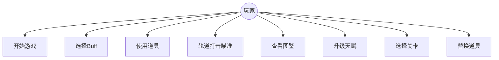

# 第二章 游戏需求分析

## 2.1 用户需求分析

从玩家角度出发，游戏需要满足以下核心需求：

### 2.1.1 游戏基本需求

1. **快速上手**：游戏规则应简单直观——炮塔自动射击，玩家只需在升级时选择 Buff，不需要复杂操作即可体验核心乐趣
2. **清晰的反馈**：每次射击、命中、击杀都应有明确的视觉和音效反馈（伤害数字、命中闪光、死亡爆炸）
3. **策略深度**：Buff 选择需要有意义——不同 Buff 组合应产生不同的游戏体验和流派（如燃烧流、冰冻流、闪电链流）
4. **成长感**：在一局游戏中，从缓慢单发到满屏弹幕的成长曲线能给予玩家强烈的满足感；跨局的永久天赋系统则提供长期追求

### 2.1.2 战斗体验需求

1. **紧张感**：波次难度应逐步递增，后期敌人数量和强度明显提升，形成"越来越难"的压迫感
2. **策略博弈**：不同敌人需要不同的应对优先级——如护士应优先消灭以阻止其治疗其他敌人，惊雷的电池应在被汲取前击杀
3. **道具应急**：提供关键时刻可使用的消耗道具，如血量危险时使用纳米修复、大量敌人逼近时使用时间扭曲

### 2.1.3 视觉与信息需求

1. **状态可读性**：HP、经验、波次、等级、道具库存等信息应清晰显示在屏幕上
2. **特效表现**：Buff 效果应有对应的视觉表现（火焰的橙色、冰霜的蓝色、闪电的金色等）
3. **图鉴查阅**：玩家可以查看已遭遇的敌人信息，了解其属性和技能

## 2.2 功能需求分析

### 2.2.1 游戏菜单模块

| 功能 | 说明 |
|---|---|
| 主菜单 | 展示游戏标题、太空背景动画，提供"开始游戏""天赋""图鉴"三个入口 |
| 关卡选择 | 以卡片形式展示多个关卡，显示关卡名称和解锁状态 |
| 暂停菜单 | 游戏内提供返回按钮，可随时退出当前对局 |
| 胜利结算 | 对局胜利后展示星级评价、统计数据、天赋点奖励 |

### 2.2.2 玩家控制模块

本项目为**自动瞄准塔防**，玩家不直接操控角色移动，控制方式包括：

| 控制 | 方式 | 说明 |
|---|---|---|
| 炮塔射击 | 自动 | 炮塔自动锁定范围内最近敌人并持续射击 |
| Buff 选择 | 点击卡片 | 升级时弹出 3-4 张 Buff 卡片，点击选择 |
| 道具使用 | 点击道具槽 | 点击激活对应道具效果 |
| 轨道打击瞄准 | 手指滑动 + 点击 | 使用轨道打击后进入瞄准模式，滑动选择落点，点击确认 |
| 道具替换 | 点击选择 | 道具槽满时，选择替换或保留 |

### 2.2.3 游戏对象管理模块

| 对象 | 创建时机 | 销毁时机 |
|---|---|---|
| 炮塔 | 游戏初始化 | 游戏结束 |
| 无人机 | 游戏初始化 + Buff 解锁 | 游戏结束 |
| 普通敌人（水银） | 波次中定时生成 | 被击杀/到达底线 |
| 精英敌人（沃土） | 第 2 波起定时生成 | 被击杀/到达底线 |
| 护士敌人 | 第 4 波起定时生成 | 被击杀/到达底线 |
| 惊雷敌人 | 第 6 波起定时生成 | 被击杀/到达底线 |
| 电池敌人 | 随惊雷一同生成 | 被汲取/被击杀 |
| 炮塔子弹 | 炮塔射击时 | 命中敌人/超时 3s/被震荡波摧毁 |
| 无人机子弹 | 无人机射击时 | 飞出屏幕/超时 3s |
| 震荡波 | 精英停止后每 2.5s | 0.6s 后自动消失 |
| Buff 效果（火焰风暴/虚空裂隙等） | Buff 触发条件满足时 | 持续时间结束 |
| 道具效果（冷冻炸弹/时间扭曲等） | 玩家使用道具时 | 持续时间结束 |

### 2.2.4 碰撞检测模块

| 碰撞对 | 检测方式 | 处理 |
|---|---|---|
| 炮塔子弹 ↔ 敌人 | AABB 矩形重叠 | 子弹消失，敌人扣血，触发命中特效和 Buff |
| 无人机子弹 ↔ 敌人 | AABB 矩形重叠 | 穿透（记录已命中敌人），敌人扣血，应用标记 |
| 炮塔子弹 ↔ 精英震荡波 | 点与圆的距离检测 | 子弹被摧毁 |
| 敌人 ↔ 屏幕底线 | Y 坐标比较 | 敌人移除，炮塔扣血 |
| 火焰风暴 ↔ 敌人 | 距离检测 | 敌人在范围内时被吸引 + 施加易燃标记 |
| 虚空裂隙 ↔ 敌人 | 距离检测 | 敌人在范围内时持续扣血 + 被吸引 |
| 子弹 ↔ 屏幕边界 | 坐标比较 | 超出屏幕时移除子弹 |

### 2.2.5 计分与状态模块

| 信息 | 显示方式 | 更新时机 |
|---|---|---|
| 当前 HP | HUD 顶部 HP 条（数值 + 进度条） | 受伤/治疗时 |
| 当前经验/等级 | HUD 经验条（等级数字 + 进度条） | 击杀敌人/获取波次奖励时 |
| 当前波次 | HUD 波次标签 | 波次切换时 |
| 波次进度 | HUD 进度条 | 每帧更新计时器 |
| Buff 列表 | 底部弹出面板（按元素分组） | 选择 Buff 后 |
| 道具库存 | 屏幕左上角垂直道具栏 | 获得/使用/替换道具时 |
| 击杀计数 | 胜利结算页 | 每击杀敌人时累加 |

### 2.2.6 音频模块

| 音频 | 触发条件 | 说明 |
|---|---|---|
| 主菜单 BGM | 进入主菜单/关卡选择 | `menu.wav` 循环播放 |
| 天赋页 BGM | 进入天赋页面 | `Talent.wav` 循环播放 |
| 战斗 BGM | 进入游戏主场景 | `Battle_in_Space_Loop.ogg` 循环播放 |
| 失败 BGM | 游戏失败 | `lose....mp3` 单次播放 |

### 2.2.7 数据存储模块

| 数据 | 存储方式 | 说明 |
|---|---|---|
| 天赋点数 | SharedPreferences | 完成关卡获得星级时增加 |
| 已解锁天赋 | SharedPreferences | 记录已解锁的天赋 ID 集合 |
| 各关卡最佳星级 | SharedPreferences | 用于计算天赋点奖励差额 |

## 2.3 非功能需求分析

### 2.3.1 性能需求

1. **帧率**：游戏运行过程应保持 60fps 基本流畅，无明显卡顿
2. **内存**：游戏对象应及时销毁，避免内存持续增长导致 OOM
3. **资源加载**：大型精灵表（EMP、燃烧特效等）应在游戏开始前预加载，避免游戏中卡顿

### 2.3.2 可用性需求

1. **操作响应**：UI 按钮点击应在 100ms 内响应；道具使用应立即生效
2. **页面布局**：HUD 信息清晰可读，不遮挡核心游戏区域
3. **控制方式**：核心操作（Buff 选择、道具使用）只需点击，简单易学
4. **异常处理**：资源加载失败不应崩溃，应优雅降级（如跳过缺失音效）

### 2.3.3 兼容性需求

1. **屏幕适配**：游戏使用相对坐标系统和 `size` 属性进行布局，应适配不同屏幕尺寸和分辨率
2. **方向锁定**：游戏强制竖屏模式（`portrait-up`）
3. **Android 版本**：最低支持 Android 5.0（API 21）

### 2.3.4 可维护性需求

1. **代码组织**：游戏组件按功能分包（components/buffs/items/screens），职责清晰
2. **资源管理**：图片/音频资源统一放在 `assets/` 目录下，按类型分子目录
3. **命名规范**：Dart 变量使用 `camelCase`，类使用 `PascalCase`，文件使用 `snake_case`

## 2.4 游戏规则分析

### 2.4.1 基本规则

**游戏目标**：操控炮塔击退 15 波敌人进攻，保卫基地（HP > 0）。

**波次系统**：
- 共 15 波，每波默认 15 秒（第 15 波 30 秒）
- 每波结束后，敌人属性递增：
  - 血量倍率 +0.25（初始 ×1.0）
  - 速度倍率 +0.08（初始 ×1.0）
  - 生成率倍率 +0.10（初始 ×1.0）
- 第 15 波：时间翻倍（30s），进入清除模式（`_waveClearing`），须消灭所有敌人方可获胜

### 2.4.2 经验与升级规则

- 击杀普通敌人：+10 经验
- 击杀精英/护士/惊雷：+30 经验
- 电池敌人：不提供经验
- 每波完成奖励：基本经验 + 天赋加成（Exp Drain：+10/波）
- 升级所需经验：`50 + (当前等级 - 1) × 30`
  - 1→2 级：50 EXP
  - 2→3 级：80 EXP
  - 3→4 级：110 EXP
  - ……

### 2.4.3 Buff 选择规则

- 升级时游戏暂停，显示 3 张 Buff 卡片（天赋 Expanded Choices 解锁后为 4 张）
- 每张卡片显示：Buff 名称、图标、当前等级、下一级效果描述
- 每个 Buff 有 3 个等级（鹰眼为 1 级），达到最大等级后不再出现
- 天赋 Free Reroll 提供每局 1 次免费刷新机会

### 2.4.4 敌人规则

| 敌人 | 首次出现波次 | 生成间隔 | 特殊机制 |
|---|---|---|---|
| 水银 | 第 1 波 | `currentSpawnInterval` | 无，基础敌人 |
| 沃土 | 第 2 波 | `currentSpawnInterval × 4` | 移动至屏幕中部停止；震荡波摧毁子弹；第 2 次震荡后产怪 |
| 护士 | 第 4 波 | `currentSpawnInterval × 3` | 每 2.5s 净化+治疗半径 100px 内所有敌人 |
| 惊雷 | 第 6 波 | `currentSpawnInterval × 6` | 三角形汲取阵型；汲取电池获得强化；满汲取可闪避子弹 |

### 2.4.5 道具规则

- **获取方式**：精英敌人 12% 概率掉落；每 5 波（5、10、15）奖励 1 个
- **库存上限**：3 个槽位
- **槽满处理**：弹出替换对话框，选择保留哪个（新道具或槽内道具）
- **使用方式**：点击道具槽立即激活

### 2.4.6 胜利/失败规则

- **胜利**：第 15 波清除所有敌人
- **失败**：炮塔 HP 降至 0
- 普通敌人到达底线：-5 HP
- 惊雷（汲取完成态）到达底线：-10 HP
- 冰霜光环护盾可吸收一次底部伤害

### 2.4.7 星级评价规则

| 星级 | 条件 |
|---|---|
| ★★★ | HP 保持 100%（满血通关） |
| ★★☆ | HP ≥ 50% |
| ★☆☆ | HP < 50%（存活通关） |

## 2.5 用例分析

### 用例图

### 主要用例详述

#### UC1：开始游戏

| 项目 | 内容 |
|---|---|
| **用例名称** | 开始新游戏 |
| **参与者** | 玩家 |
| **前置条件** | 应用已启动，显示主菜单 |
| **基本流程** | 1. 玩家点击"开始游戏" → 2. 进入关卡选择页 → 3. 玩家点击已解锁关卡 → 4. 进入游戏主场景 → 5. 游戏初始化，开始第 1 波 |
| **后置条件** | 游戏进入运行状态 |

#### UC2：选择 Buff

| 项目 | 内容 |
|---|---|
| **用例名称** | 选择 Buff |
| **参与者** | 玩家 |
| **前置条件** | 玩家经验达到升级阈值 |
| **基本流程** | 1. 游戏暂停 → 2. 弹出 3-4 张 Buff 卡片 → 3. 玩家阅读效果 → 4. 玩家点击选择一张 → 5. Buff 等级 +1，游戏恢复 |
| **备选流程** | 3a. 玩家点击"刷新"按钮（如有免费重抽次数）→ 重新随机生成 Buff 卡片 |
| **后置条件** | 玩家获得新 Buff 效果，游戏继续 |

#### UC3：使用道具

| 项目 | 内容 |
|---|---|
| **用例名称** | 使用消耗道具 |
| **参与者** | 玩家 |
| **前置条件** | 道具栏至少有一个道具 |
| **基本流程** | 1. 玩家点击道具栏中的道具图标 → 2. 道具效果立即激活 → 3. 道具从库存中移除 |
| **备选流程** | 2a. 若为"轨道打击"道具 → 进入瞄准模式，玩家滑动选择目标后点击确认 |
| **后置条件** | 道具效果生效，库存更新 |

#### UC5：查看图鉴

| 项目 | 内容 |
|---|---|
| **用例名称** | 查看怪物图鉴 |
| **参与者** | 玩家 |
| **前置条件** | 在主菜单页面 |
| **基本流程** | 1. 玩家点击"图鉴"按钮 → 2. 进入图鉴页面 → 3. 查看 4 种敌人的精灵动画、属性、技能描述 → 4. 点击返回 |
| **后置条件** | 返回主菜单 |

#### UC6：升级天赋

| 项目 | 内容 |
|---|---|
| **用例名称** | 解锁永久天赋 |
| **参与者** | 玩家 |
| **前置条件** | 玩家拥有可用天赋点数（完成关卡获得星级） |
| **基本流程** | 1. 玩家点击"天赋" → 2. 进入星图天赋页 → 3. 点击可解锁的节点（蓝色高亮）→ 4. 天赋点数 -1，节点变为金色已解锁 |
| **备选流程** | 3a. 点击已解锁节点 → 取消解锁，天赋点数 +1 |
| **后置条件** | 天赋生效，影响后续所有对局 |
