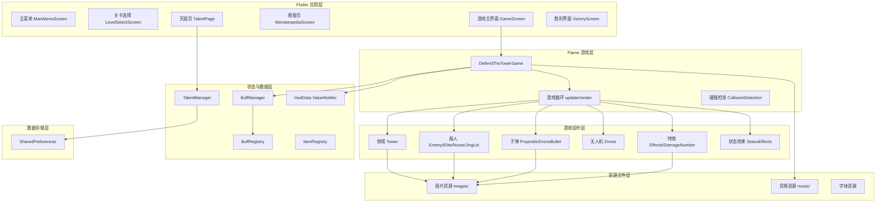
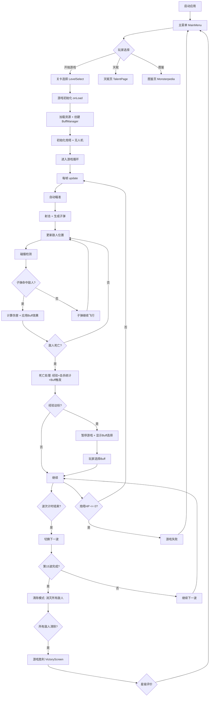
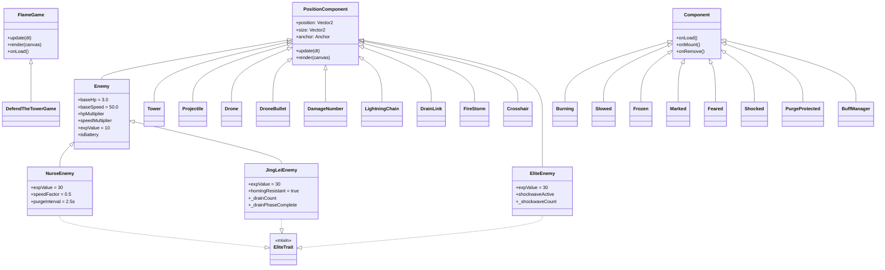
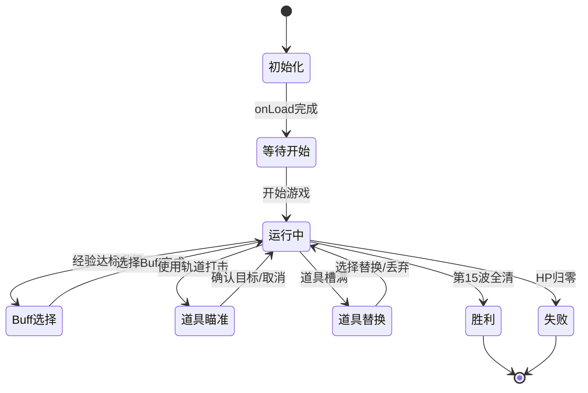

# 第三章 游戏总体设计

## 3.1 游戏总体架构

本项目采用**分层架构**设计，从用户界面到底层数据存储分为六个层次：



### 各层职责

**Flutter 应用层**：负责菜单、设置、关卡选择、天赋页面等普通 UI 界面。使用标准 Flutter Widget 构建，通过 Navigator 管理路由切换。

**Flame 游戏层**：核心游戏引擎层。`DefendTheTowerGame` 继承 `FlameGame`，管理游戏循环（update/render）、碰撞检测、波次管理和 Buff 应用。通过 `ValueNotifier<HudData>` 单向通知 Flutter 层更新 HUD。

**游戏组件层**：所有游戏实体（炮塔、敌人、子弹、无人机、特效）均为 Flame `PositionComponent` 子类，挂载在游戏组件树中，由引擎自动管理生命周期。

**状态与数据层**：`BuffManager` 管理运行时的 Buff 等级和效果参数；`BuffRegistry` 和 `ItemRegistry` 提供静态数据定义；`HudData` 封装需要传递给 UI 层的游戏状态。

**数据存储层**：使用 `shared_preferences` 持久化天赋解锁状态和星级评价。

**资源文件层**：管理所有图片精灵、序列帧动画和背景音乐文件。

## 3.2 游戏流程设计



### 关键判断节点

| 判断 | 条件 | 结果 |
|---|---|---|
| 经验达标 | `_exp >= expToNextLevel` | 暂停游戏，弹出 Buff 选择界面 |
| 波次计时结束 | `_waveTimer <= 0` | 切换至下一波，递增难度 |
| 第 15 波完成 | `_wave > 15` | 进入清除模式（`_waveClearing = true`） |
| 所有敌人清除 | `enemies.isEmpty && _waveClearing` | 游戏胜利 |
| 炮塔 HP 归零 | `_hp <= 0` | 游戏失败 |
| 敌人到达底线 | `enemy.position.y > size.y - 10` | 扣除炮塔 HP |

## 3.3 游戏场景设计

### 场景清单

| 场景 | 文件 | 主要内容 |
|---|---|---|
| **主菜单** | `main_menu.dart` | 太空背景、星球动画、开始游戏/天赋/图鉴按钮 |
| **关卡选择** | `level_select.dart` | 5 个关卡卡片，已解锁/锁定状态，点击进入游戏 |
| **天赋页** | `talent_page.dart` | 六边形星图天赋树，节点解锁/未解锁状态，天赋点余额 |
| **怪物图鉴** | `monsterpedia.dart` | 4 类敌人卡片，精灵动画预览，属性与技能说明 |
| **游戏主场景** | `game_screen.dart` | Flame GameWidget + Flutter HUD 叠加层（HP/EXP/波次/道具栏） |
| **胜利界面** | `victory_screen.dart` | 星级评价动画、击杀统计、剩余 HP、天赋点奖励 |

### 场景切换流程

```
主菜单 ──开始游戏──→ 关卡选择 ──选择关卡──→ 游戏主场景 ──胜利──→ 胜利界面
  │                      │                      │                │
  ├──天赋──→ 天赋页      │                      └──失败──→ 主菜单  │
  ├──图鉴──→ 图鉴页      │                                       │
  ↑                      ←──────────────────────────────────────┘
  └──────────── 返回 ────────────────────────────────────────────┘
```

## 3.4 游戏对象设计

### 核心对象列表

#### 炮塔（Tower）
- **位置**：屏幕底部中央 `(size.x/2, size.y * 0.92)`
- **职责**：自动瞄准范围内最近的敌人，持续发射追踪子弹
- **状态**：正常、过载（道具触发，射速翻倍）
- **素材**：`Turret.png` 底座 + 代码绘制的白色旋转炮管

#### 敌人（Enemy）
- **基类**：`Enemy extends PositionComponent`，定义通用属性（HP、速度、状态效果查询）和移动逻辑
- **4 种子类**：
  - **水银（普通敌人）**：基础单位，大量生成，无特殊技能
  - **沃土（精英敌人）**：移动至屏幕中部停止，周期性释放震荡波摧毁子弹，第 2 次震荡波后开始产怪
  - **护士（辅助敌人）**：第 4 波起出现，每 2.5s 净化周围敌人异常状态 + 治疗 80% 已损失 HP
  - **惊雷（Boss 级精英）**：第 6 波起出现，初始与 3 个电池敌人以闪电链相连，汲取电池获得速度/减伤/闪避能力

#### 子弹（Projectile / DroneBullet）
- **Projectile**：炮塔发射的追踪子弹，440px/s，3s 生命周期，击中后消失
- **DroneBullet**：无人机发射的穿透子弹，560px/s，可穿透多个敌人
- **碰撞区域**：`toRect()` 方法返回 AABB 矩形

#### 无人机（Drone）
- **数量**：最多 3 台（通过 Drone Expansion Buff 解锁）
- **位置**：炮塔右侧、左侧、上方
- **职责**：独立瞄准、发射穿透子弹

#### 状态效果（Status Effects）
- **实现方式**：作为 Flame `Component` 子节点挂载到敌人上
- **类型**：燃烧（Burning）、减速（Slowed）、冻结（Frozen）、标记（Marked）、恐惧（Feared）、感电（Shocked）、净化保护（PurgeProtected）

#### 道具（Items）
- **5 种消耗品**：纳米修复（回血）、冷冻炸弹（全屏冻结）、过载核心（射速翻倍）、轨道打击（手动瞄准 AoE）、时间扭曲（全屏减速）
- **库存**：最多 3 个槽位

## 3.5 类结构设计

### 核心继承关系



### 关键关系说明

| 关系 | 说明 |
|---|---|
| **继承** | `NurseEnemy`、`JingLeiEnemy` 继承 `Enemy` 基类，复用移动、状态效果和渲染逻辑 |
| **Mixin** | `EliteTrait` 被 `EliteEnemy`、`NurseEnemy`、`JingLeiEnemy` 混入，统一精英类型判断（`enemy is EliteTrait`） |
| **组合** | `DefendTheTowerGame` 拥有 `BuffManager`、`Tower`、`Drone` 等组件 |
| **聚合** | 敌人组件上挂载多个状态效果子组件（Burning、Slowed 等），敌人移除时自动级联移除 |
| **依赖** | 游戏主类依赖 `TalentManager` 读取永久天赋，依赖 `AudioManager` 播放音乐 |

## 3.6 游戏状态设计

### 状态定义



### 状态转换条件

| 当前状态 | 目标状态 | 转换条件 |
|---|---|---|
| 初始化 | 等待开始 | `onLoad()` 异步加载完成，炮塔和无人机就位 |
| 等待开始 | 运行中 | 计时器触发，开始生成敌人 |
| 运行中 | Buff 选择 | `_exp >= expToNextLevel`，显示 `BuffCardOverlay` |
| Buff 选择 | 运行中 | 玩家点击选择 Buff，调用 `selectBuff(id)` |
| 运行中 | 道具瞄准 | 玩家点击轨道打击道具，显示 `Crosshair` |
| 道具瞄准 | 运行中 | 玩家点击目标位置 / 点击取消 |
| 运行中 | 道具替换 | 获得道具时 `_items.length >= maxItemSlots` |
| 道具替换 | 运行中 | 玩家选择替换槽位或丢弃新道具 |
| 运行中 | 胜利 | `_waveClearing == true && enemies.isEmpty` |
| 运行中 | 失败 | `_hp <= 0`（敌人到达底线累计伤害） |

**暂停机制**：当进入 Buff 选择、道具瞄准或道具替换状态时，`_paused = true`。此时游戏循环调用 `super.update(0)`（传入 dt=0），冻结所有子组件的 `update()`，实现全局暂停。

## 3.7 数据设计

### 运行时数据

| 数据 | 类型 | 说明 |
|---|---|---|
| `_hp` | int | 炮塔当前生命值（初始 100 + 天赋加成） |
| `_maxHp` | int | 炮塔最大生命值 |
| `_exp` | int | 当前经验值 |
| `_level` | int | 当前等级 |
| `_expToNextLevel` | int | 升级所需经验（50 + (level-1) × 30） |
| `_killCount` | int | 累计击杀数 |
| `_wave` | int | 当前波次（1-15） |
| `_waveTimer` | double | 波次剩余时间（15s） |
| `_enemyHpBonus` | double | 敌人血量倍率（每波 +0.25） |
| `_enemySpeedBonus` | double | 敌人速度倍率（每波 +0.08） |
| `_spawnRateBonus` | double | 生成率倍率（每波 +0.10） |

### 持久化数据（SharedPreferences）

| Key | 类型 | 说明 |
|---|---|---|
| `talent_points` | int | 可用天赋点数 |
| `unlocked_talents` | String (逗号分隔) | 已解锁的天赋 ID 列表 |
| `star_level_X` | int | 关卡 X 的最佳星级（1-3） |

**保存时机**：天赋解锁时立即保存；星级评价更新时立即保存。
**读取时机**：应用启动时（`TalentManager.init()`）；进入游戏时（读取 HP 加成等）。
**异常处理**：首次启动无数据时返回默认值（0 天赋点、0 星）。

## 3.8 素材与资源设计

### 图片资源

| 资源 | 文件名 | 说明 |
|---|---|---|
| 主菜单背景 | `Space Background_3.png` | 太空星云背景 |
| 战斗背景 | `SpaceBackground.gif` | 动态太空 GIF |
| 炮塔底座 | `Turret.png` | 中央炮塔 |
| 普通敌人 | `enemy-1.png` | 水银，单帧静态精灵 |
| 精英敌人 | `enemy-2.png` | 沃土，16 帧精灵表（32×96/帧） |
| 惊雷敌人 | `enemy-3.png` | 4 帧精灵表（32×32/帧） |
| 护士敌人 | `enemy-4/1~3.png` | 3 帧精灵序列 |
| 炮塔子弹 | `bullet_01.png` | 普通追踪子弹 |
| 无人机子弹 | `bullet-02.png` | 穿透子弹（212×92 → 69×30） |
| 火焰子弹 | `bullet_03.png` | 火焰系视觉变体 |
| 无人机 | `drone-1.png` | 10 帧精灵表（22×24/帧） |
| 命中特效 | `Hit_effect_01.png` | 12 帧精灵表（2×6 网格） |
| 死亡爆炸 | `explosion/1~8.png` | 8 帧序列帧 |
| EMP 冲击波 | `emp.png` | 16 帧精灵表（2048×128，每帧 128×128） |
| 燃烧特效 | `BurningEffect.png` | 12 帧火焰动画 |
| 闪电链 | `lightning_chain/comp_0001~0025.png` | 25 帧序列帧 |
| 雷击 | `lightning_strike/comp_0005~0015.png` | 11 帧序列帧 |
| 火焰风暴 | `fire_storm/fire_ball_3_0~29.png` | 30 帧序列帧 |
| 菜单动画 | `Planet1.gif`, `Planet2.gif` | 星球装饰 GIF |

### 音频资源

| 资源 | 文件名 | 说明 |
|---|---|---|
| 主菜单背景音乐 | `music/menu.wav` | 主菜单和关卡选择界面 |
| 天赋页背景音乐 | `music/Talent.wav` | 天赋星图界面 |
| 战斗背景音乐 | `music/Battle_in_Space_Loop.ogg` | 游戏内循环播放 |

> 素材来源说明：图片素材通过在线资源平台获取并二次编辑；背景音乐使用免费商用音乐；精灵表通过 Photoshop 进行裁剪和拼接处理。
